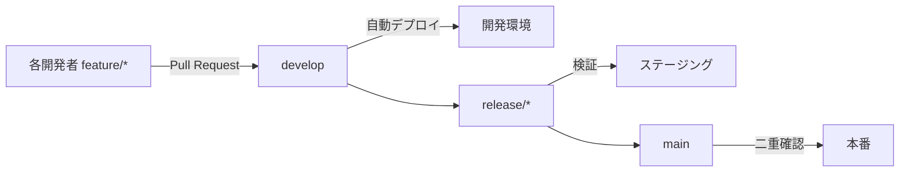
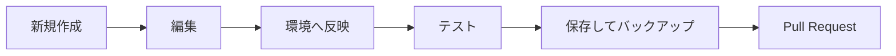

# Salesforce Dev Manager


**これ1つで Salesforce の開発サイクルを完結。** Org/環境の管理・各環境への簡単デプロイ（開発→ステージング→本番）・Git/GitHub・テスト・CI/CD を、**初心者でもほぼクリック操作だけ**で回せる VSCode 拡張です。

> 💡 はじめての方へ：左のアクティビティバーの **Salesforce Dev Manager** アイコンを開くと「ホーム」が出ます。上部の **「次にやること」** に従って進めば、迷わずセットアップ〜開発できます。

---

## なぜこれ1つでいいのか

Salesforce のチーム開発に必要な作業を、1画面（ホーム）から流れに沿って実行できます。

```
作成 → 環境と同期 → テスト → 保存(バックアップ) → Pull Request → 環境へデプロイ → タグ(リリース)
 ✨      ⬇️⬆️         🧪        💾                   🔀              🚀                🏷️
```

### ブランチと環境（チーム開発の全体像）



> 現在のブランチを見て、ツールが「今どの環境か」を自動判定します（対応は `sf-teamflow.json` で共有）。

### 個人の1日の流れ



---

## ホーム画面（クリック中心・段階表示）

- 🧭 **「次にやること」** … 状況を見て、今やるべき操作を1つだけ大きく提案（変更があれば保存、未バックアップなら同期、接続切れなら再接続…）
- 🗒️ **現状況の1行サマリ** … 「いま『feature/x』（開発環境）で作業中。変更3件が未保存・未バックアップ2件。反映先=『dev』。」
- 📝 **保存される変更ファイル一覧**（折りたたみ）… 保存前に対象を確認
- 🪜 **段階表示** … よく使う「①開発／②保存」だけ常時表示、テスト/デプロイ/タグ等は「▸ もっと操作」に格納
- ☁️ **Orgカード** … クリックで既定切替、**🔗開く / 🔌再接続 / ⏳有効期限(スクラッチ)** を表示。本番は⚠️赤

---

## 主な機能

### 🌍 環境・Org
- 認証済みOrgを Production / Sandbox / DevHub / Scratch に分類表示（本番は赤で警告）
- 既定Orgの切替・ブラウザで開く・**接続切れの検知＋ワンクリック再接続**・スクラッチの有効期限表示
- **環境セットアップウィザード**（3ステップ）で 開発/ステージング/本番 を**ドロップダウン割当**

### 🛠️ 開発
- ✨ **新規コンポーネント作成**（Apexクラス/トリガ/LWC/Aura のひな形を生成）
- 📥 **メタデータ取得**（39種類から選択 / `package.xml` 指定）
- ⬇️ **環境から取込** / ⬆️ **環境へ反映**（**すべて or 資材を選んで**）
- 🧪 **Apexテスト実行** / 🔁 **反映してテスト**（高速ループ）

### 💾 保存・共有（Git/GitHub）
- 💾 **保存してバックアップ**（add→commit→push。メッセージは日時既定でEnterのみ）
- 🔄 **GitHubと同期**（pull→push）
- 🌿 **ブランチ管理**（切替/作成/削除）/ 🔀 **Pull Request作成** / 🏷️ **タグ管理**（次バージョン自動採番）
- **GitHubに公開**（`gh repo create`）

### 🚀 リリース
- **環境へデプロイ**（開発→ステージング→本番 を選択）。**確認画面に対象ファイル一覧を表示**、**本番は二重確認**
- **検証（お試し）**（デプロイせず差分チェック）

### ⚙️ チーム共有設定 `sf-teamflow.json`
環境名・Orgエイリアス・ブランチ（glob可）・テストレベルを定義し、リポジトリで共有。現在のブランチから環境を自動判定します。

### 🚀 CI/CD（GitHub Actions）
チーム設定から PR検証 / 環境ブランチへのデプロイ ワークフロー＋CODEOWNERS を生成（JWT認証）。

---

## クイックスタート
1. SFDXプロジェクト（`sfdx-project.json`）を開く、または「新しいプロジェクトを作成」
2. アクティビティバーの **Salesforce Dev Manager** を開く
3. ホームの「次にやること」に従って **① Orgを認証 → ② 環境を設定**
4. 日々は ✨新規作成 → ⬆️反映 → 🧪テスト → 💾保存 → 🔀PR → 🚀環境へデプロイ

---

## 必要環境
- VSCode 1.85 以上
- [Salesforce CLI (`sf`)](https://developer.salesforce.com/tools/salesforcecli)（PATHが通っていること）
- Git（GitHub公開・PR作成には [GitHub CLI (`gh`)](https://cli.github.com/)）

---

## 対応コマンド一覧（コマンドパレット: `SFDevManager:`）

| 分類 | コマンド | 内容 |
|---|---|---|
| 環境 | Org一覧を更新 / 新しいOrgを認証 / このOrgに再接続 | 認証Orgの取得・追加・再接続 |
| 環境 | このOrgを既定に設定 / ブラウザでOrgを開く / Org IDをコピー / 認証を解除 | 既定切替・ブラウザ起動など |
| 環境 | 環境セットアップウィザード | 開発/ステージング/本番をクリックで割当 |
| 環境 | スクラッチOrgを作成 / 削除 | 使い捨て開発Org |
| 開発 | 新しいプロジェクトを作成 | `sf project generate` |
| 開発 | 新しいコンポーネントを作成 | Apexクラス/トリガ/LWC/Aura |
| 開発 | メタデータを取得 / manifestで取得 | 39種類から選択 / package.xml |
| 開発 | 環境(Org)に反映 / 取り込み | push（全部/資材選択）/ pull |
| テスト | Apexテストを実行 / Orgへ反映してテスト | 結果・カバレッジ表示 / 高速ループ |
| リリース | 環境を選んでデプロイ / Git差分をデプロイ / 検証 / 差分プレビュー | 開発→ステージング→本番、本番二重確認 |
| 保存 | 保存してバックアップ / GitHubと同期 / GitHubに公開 | commit+push / pull+push / `gh repo create` |
| 保存 | 作業ブランチを作成 / ブランチを管理 | feature運用・切替/作成/削除 |
| 保存 | Pull Requestを作成 | `gh pr create`（マージ先選択） |
| 保存 | リリースタグを作成 / タグを管理 | 次バージョン自動採番・push/削除 |
| 設定 | チーム設定を開く / CI/CDを生成 / チーム開発ガイド / 設定 | sf-teamflow.json・GitHub Actions・ガイド |

> ほとんどの操作はサイドバーの「ホーム」からクリックだけで実行できます。

## 開発（このリポジトリ）
```bash
npm install
npm run check-types      # tsc --noEmit
npm test                 # ピュアロジックの単体テスト (node:test, 48件)
npm run build            # esbuild
npm run package          # .vsix 生成
```
アーキテクチャ：UI（`vscode`依存）とドメインロジック（純粋関数）を分離。`orgService`/`gitService`/`deployService`/`projectService`/`teamflowConfig`/`cicd/templates`/`tagUtils` は副作用のない純粋関数として `node:test` でテスト。

## ライセンス
MIT
